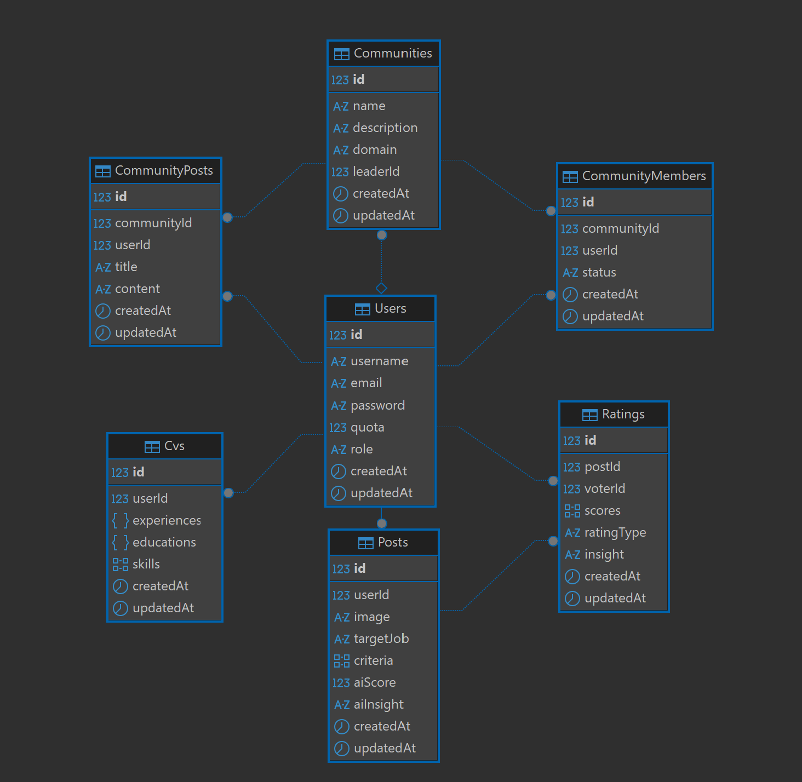

# Impression — Server

> Backend API for **Impression**, a professional profile rating platform where users rate each other's profiles based on AI-generated criteria, build their CV, and get matched with relevant job listings.

**Live API:** `https://api.skirk.my.id` &nbsp;|&nbsp; **Client:** [impression-job.vercel.app](https://impression-job.vercel.app) &nbsp;|&nbsp; **Org:** [HCK94-FP-Impression](https://github.com/HCK94-FP-Impression)

---

## Tech Stack


---

## Features

- **Cookie-based JWT authentication** — httpOnly cookie, secure in production
- **Quota economy** — creating or updating a post costs 5 quota; rating someone earns +1 quota
- **AI-generated rating criteria** — Gemini generates 3 role-specific adjectives per target job
- **Three-segment rating system** — `social`, `professional_recruiter`, `professional_same_job` (auto-detected from voter role and target job)
- **AI profile analysis** — Gemini analyzes a user's CV against their target job and criteria (requires CV with min. 1 experience, 1 education, 1 skill)
- **Randomized feed** — prioritizes unrated posts; cycles through all posts once all have been rated
- **CV management** — structured JSON storage for experiences, educations, and skills with date validation
- **Community system** — join-request flow with leader approve/reject, community dashboard, leaderboard (social and professional), and forum posts
- **Job recommendations** — Jooble API integration based on user's target job
- **Test coverage: ~95%** — Jest + Supertest

---

## Entity Relationship Diagram



---

## API Endpoints

All endpoints require authentication via cookie (`access_token`) unless marked **Public**.

### Auth — `/auth`

| Method | Endpoint         | Description           | Auth     |
| ------ | ---------------- | --------------------- | -------- |
| POST   | `/auth/register` | Register a new user   | Public   |
| POST   | `/auth/login`    | Login and set cookie  | Public   |
| GET    | `/auth/me`       | Get current user data | Required |

### Posts — `/posts`

| Method | Endpoint                   | Description                                                           | Auth     |
| ------ | -------------------------- | --------------------------------------------------------------------- | -------- |
| GET    | `/posts/feed`              | Get a random post to rate (skips own post)                            | Required |
| GET    | `/posts/my-post`           | Get own post with rating breakdown and insights                       | Required |
| POST   | `/posts`                   | Create a post (costs 5 quota, 1 post per user, image required)        | Required |
| PUT    | `/posts`                   | Update own post (costs 5 quota; changing criteria resets all ratings) | Required |
| POST   | `/posts/generate-criteria` | Generate 3 AI criteria for a target job                               | Required |
| POST   | `/posts/analyze`           | Run AI analysis on own profile against CV (one-time)                  | Required |

### Ratings — `/ratings`

| Method | Endpoint   | Description                                           | Auth     |
| ------ | ---------- | ----------------------------------------------------- | -------- |
| POST   | `/ratings` | Submit or update a rating for a post (earns +1 quota) | Required |

**Rating types (auto-detected):**

- `professional_recruiter` — voter role is `recruiter`
- `professional_same_job` — voter is a job seeker with the same `targetJob` as the post
- `social` — all other voters

### CV — `/cvs`

| Method | Endpoint    | Description                                             | Auth     |
| ------ | ----------- | ------------------------------------------------------- | -------- |
| GET    | `/cvs`      | Get own CV                                              | Required |
| POST   | `/cvs/add`  | Create CV (costs 5 quota)                               | Required |
| PATCH  | `/cvs/edit` | Update CV (costs 5 quota; resets AI analysis if exists) | Required |

### Communities — `/communities`

| Method | Endpoint                                   | Description                                                      | Auth     |
| ------ | ------------------------------------------ | ---------------------------------------------------------------- | -------- |
| GET    | `/communities`                             | List all communities (filter by `search`, `domain`)              | Required |
| GET    | `/communities/:id`                         | Get community detail + membership status                         | Required |
| POST   | `/communities/:id/join`                    | Request to join a community                                      | Required |
| PATCH  | `/communities/:id/members/:userId/approve` | Approve a join request (leader only)                             | Required |
| PATCH  | `/communities/:id/members/:userId/reject`  | Reject a join request (leader only)                              | Required |
| GET    | `/communities/:id/dashboard`               | Get dashboard with leaderboard and stats (approved members only) | Required |
| GET    | `/communities/:id/posts`                   | Get forum posts (approved members only)                          | Required |
| POST   | `/communities/:id/posts`                   | Create a forum post (approved members only)                      | Required |

### Jobs — `/jobs`

| Method | Endpoint | Description                                                     | Auth     |
| ------ | -------- | --------------------------------------------------------------- | -------- |
| GET    | `/jobs`  | Get job recommendations based on user's target job (Jooble API) | Required |

---

## Getting Started

### Prerequisites

- Node.js v18+
- PostgreSQL

### Installation

```bash
git clone https://github.com/HCK94-FP-Impression/impression-server.git
cd impression-server
npm install
```

### Environment Variables

Create a `.env` file based on `.env-example`:

```env
JWT_SECRET=

CLOUDINARY_API_KEY=
CLOUDINARY_API_SECRET=
CLOUDINARY_CLOUD_NAME=

GEMINI_API_KEY=

JOOBLE_API_KEY=
JOOBLE_API_URL=https://jooble.org/api
```

### Database Setup

```bash
npx sequelize-cli db:create
npx sequelize-cli db:migrate
npx sequelize-cli db:seed:all
```

### Running the Server

```bash
npm run dev
```

---

## Running Tests

```bash
# Run all tests
npm test

# Run with coverage report
npm run test:coverage
```

Test coverage: **~95% statement coverage** across all controllers, middlewares, helpers, and models.

---

## Team

| Role         | Name               | GitHub                                             |
| ------------ | ------------------ | -------------------------------------------------- |
| Lead Backend | Ahmad Luthfi Hanif | [@AhmadSerafu](https://github.com/AhmadSerafu)     |
| Backend      | Aaron Arquette     | [@aaronarquette](https://github.com/aaronarquette) |
| Frontend     | Trimulia           | [@Trimulia02](https://github.com/Trimulia02)       |

---

_Hacktiv8 Full Stack JavaScript Bootcamp — Grand Final Project, Cohort HCK-94_
